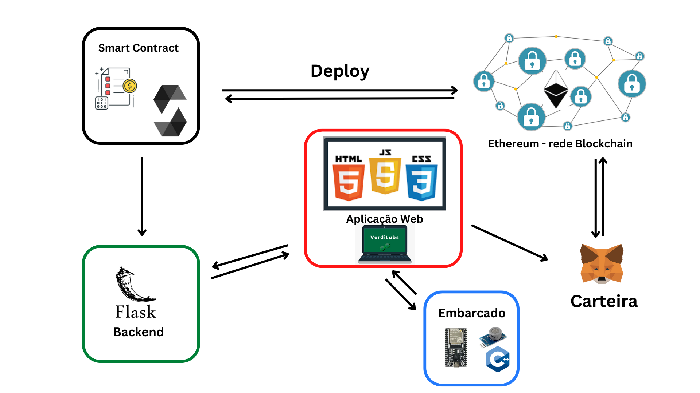

# iHack2green
"O iHack2Green é o maior hackathon de hidrogênio do Brasil, e, nessa segunda edição, os participantes deverão desenvolver soluções para desafios relacionados a inovação em modelos de negócios financeiros para estimular o investimento e a compra de H2V, geração de negócios para tornar o Brasil reconhecido no mercado de H2V e aceleração da descarbonização da indústria por meio do H2V."

Disponível em: https://ihack2green.com.br/#hackathon (Data de acesso em 21/05/2023)

## Visão Geral

## Tecnologias Utilizadas
* HTML, CSS e JavaScript para a aplicação
* Python como servidor backend 
* Solidity para smart contract
* C++ para o embarcado

## Recursos
## Arquitetura da Solução

A solução é composta por várias tecnologias interligadas para fornecer um sistema completo. A arquitetura envolve os seguintes componentes:

    

#### Frontend
O frontend é desenvolvido utilizando HTML, CSS e JavaScript (HTML/CSS/JS). É responsável por fornecer a interface do usuário, permitindo interações com o sistema. Os usuários podem visualizar informações e enviar solicitações para o backend através de formulários ou botões.
### Backend
O backend é implementado utilizando o Flask, um framework de desenvolvimento web em Python. Ele processa as solicitações recebidas do frontend, gerencia a lógica de negócios e se comunica com outros componentes da solução.
### Conexão com a Blockchain
A conexão com a blockchain é estabelecida utilizando a linguagem Solidity, que é usada para desenvolver contratos inteligentes na plataforma Ethereum. O backend interage com a blockchain para executar transações, recuperar dados ou atualizar o estado dos contratos inteligentes.
### Carteira Metamask
A carteira Metamask é uma extensão de navegador que permite aos usuários interagir com aplicativos descentralizados baseados em blockchain. Ela fornece uma maneira segura de gerenciar chaves privadas e assinar transações na blockchain. O backend utiliza a carteira Metamask para autenticação e assinatura de transações.
### Sistema Embarcado
O sistema embarcado é desenvolvido em C++ e é executado em um dispositivo ESP32. Ele se comunica com o sensor MQ-7, que fornece dados relacionados a gases. Os dados coletados pelo sensor são enviados para o backend para processamento e análise.

Essa arquitetura permite que os usuários interajam com o sistema através do frontend, enquanto o backend gerencia a lógica de negócios e a comunicação com a blockchain. O sistema embarcado coleta os dados do sensor e os envia para o backend, utilizando a carteira Metamask para autenticação e assinatura de transações na blockchain.
## Front-end 

    

    

O frontend possui quatro funcionalidades principais, que são as seguintes:

Compra de H2V (com futura integração com a blockchain)
Essa funcionalidade permite que os usuários comprem H2V (Hidrogênio Verde) através do sistema. Os usuários podem fornecer detalhes da transação, como a quantidade desejada de H2V e a carteira Ethereum para a transação. No futuro, será feita a integração com a blockchain para registrar e validar as transações.

    

Análise dos dados fornecidos pelo sistema embarcado
Essa funcionalidade permite aos usuários visualizar e analisar os dados fornecidos pelo sistema embarcado. Os dados coletados pelo sensor MQ-7 são processados e apresentados em gráficos ou tabelas, fornecendo informações relevantes sobre a qualidade do ar ou níveis de gases detectados.

    

Configuração do perfil
Essa funcionalidade permite aos usuários configurar o seu perfil no sistema. Eles podem fornecer informações pessoais, como nome, endereço de e-mail, preferências de notificação, entre outros. Esses dados são armazenados no backend para personalizar a experiência do usuário e fornecer informações relevantes.

    

Calculadora para economia de dinheiro mensal
Essa funcionalidade permite aos usuários calcular a economia de dinheiro mensal obtida ao utilizar o sistema. Os usuários podem inserir detalhes sobre seu consumo atual e receber uma estimativa de economia baseada em dados históricos e modelos de previsão. Essa calculadora ajuda a demonstrar os benefícios financeiros do sistema.

    

Essas funcionalidades fornecem uma experiência abrangente aos usuários, permitindo a compra de H2V, análise dos dados fornecidos pelo sistema embarcado, configuração do perfil pessoal e estimativa de economia de dinheiro mensal.

## Back-end 

API e Rotas
A aplicação possui várias rotas para fornecer diferentes funcionalidades aos usuários. A seguir, estão documentadas as rotas disponíveis e suas respectivas funções:

### Rota: /
Renderiza o template login.html para exibir a página inicial do sistema.
### Rota: /analises
Renderiza o template analysis.html para exibir a página de análises. Passa os dados a partir da conexão com a integração com um banco de dados (implementação futura) para o template.
### Rota: /menu
Renderiza o template menu.html para exibir o menu principal do sistema.
### Rota: /h2v
Renderiza o template buyh2v.html para exibir a página de compra de H2V. Passa os dados a partir da conexão com a integração com um banco de dados (implementação futura) para o template.
### Rota: /configuracoes

Renderiza o template perfil.html para exibir a página de configurações de perfil do usuário.
### Rota: /calculadora

Renderiza o template calculator.html para exibir a calculadora de economia de dinheiro mensal.
Essas rotas fornecem os endpoints necessários para cada funcionalidade do sistema, permitindo que o frontend renderize os templates correspondentes de acordo com as requisições do usuário.

## Team:
[Emanuel de Oliveira Costa](https://www.linkedin.com/in/emanuel-45b637185/)
[Filipi Enzo Siqueira Kikchi](https://www.linkedin.com/in/filipi-enzo-siqueira-kikuchi-1811a9213/)

[Lucas Britto](https://www.linkedin.com/in/lucas-britto-376665208/)
[Vitória Rodrigues de Oliveira](https://www.linkedin.com/in/vit%C3%B3ria-rodrigues-de-oliveira-bb955921b/)
